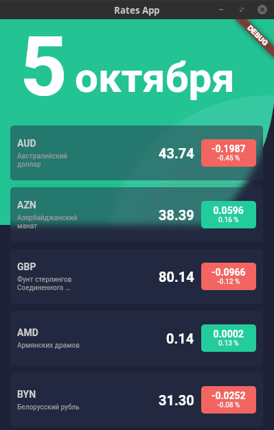

# Desktop Flutter Example

Тестовое приложение, предназначенное для проверки возможности создания flutter-приложения под desktop.

За основу взят пример из проекта [flutter-desktop-embedding](https://github.com/google/flutter-desktop-embedding/tree/master/example).

В приложении реализованы:

- переходы между экранами;

- анимация перехода между экранами;

- менеджер состояния `Provider`;

- сетевые запросы к удалённому API;

Данные о курсе валют любезно предоставлены ресурсом [Курсы ЦБ РФ в XML и JSON, API](https://www.cbr-xml-daily.ru/).

## Building and Running

To build without running, use `flutter build macos`/`windows`/`linux` rather than `flutter run`, as with
a standard Flutter project.

